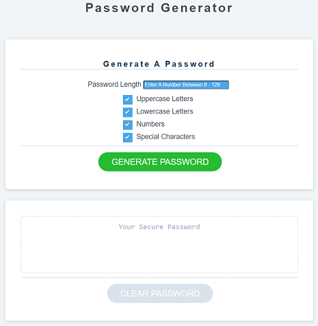
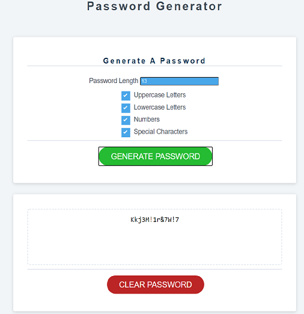
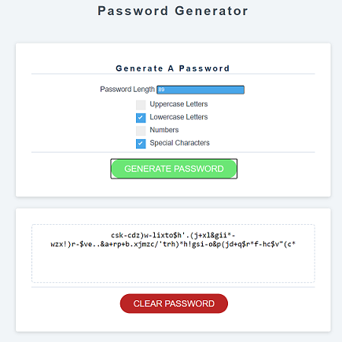
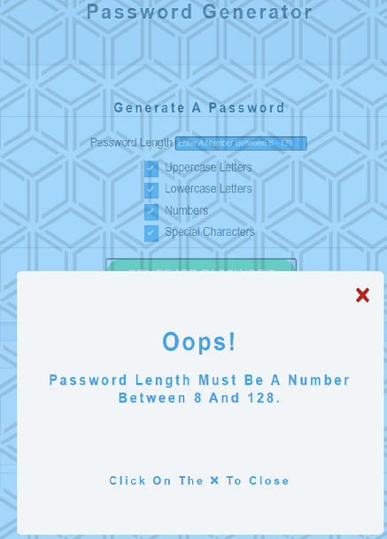
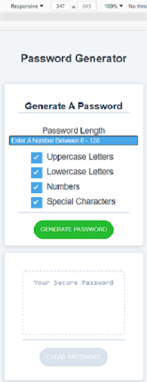

# Password-Generator_v2
- This application can generate a random password based on criteria selected by the user. 
- This app runs in the browser, and  features dynamically updated HTML and CSS powered by Vanilla JavaScript code.
- It has a clean and polished user interface that is responsive, ensuring that it adapts to multiple screen sizes.
- This application is a refactoring of a previous password project. The previous project used window prompts, confirms and alerts to gather user selections and provide error information. 
- This refactored application uses a form to collect user selections and modals to provide the user with error information.
  
### This application can be accessed at
https://essennejaye.github.io/password-generator_v2/

### Screenshots






```` HTML
      <div class="card password-form">
        <h3 class="card-header">generate a password</h3>

        <div class="form-control">
          <div class="num-charac">
            <label for="password-length">password length</label>
            <input
              type="number"
              id="password-length"
              name="password-length"
              placeholder="enter a number between 8 - 128"
            />
          </div>
          <label class="container"
            >uppercase letters
            <input type="checkbox" checked="checked" value="uppercase" />
            <span class="checkmark"></span>
          </label>

          <label class="container"
            >lowercase letters
            <input type="checkbox" checked="checked" value="lowercase" />
            <span class="checkmark"></span>
          </label>

          <label class="container"
            >numbers
            <input type="checkbox" checked="checked" value="numbers" />
            <span class="checkmark"></span>
          </label>

          <label class="container"
            >special characters
            <input type="checkbox" checked="checked" value="specials" />
            <span class="checkmark"></span>
          </label>
        </div>
        <div class="card-footer">
          <button id="generate" class="btn submit-btn">
            generate password
          </button>
        </div>
      </div>

      <section class="card">
        <div class="card-body">
          <textarea
            readonly
            id="password"
            placeholder="your secure password"
          ></textarea>
        </div>
        <div class="card-footer">
          <button id="clearBtn" class="btn clear-btn disabled">
            clear password
          </button>
        </div>
      </section>
    </main>
    <!-- modal -->
    <div class="modal-overlay">
      <div class="modal-container">
        <h3>modal content</h3>
        <button class="close-btn">
          <i class="fas fa-times"></i>
        </button>
      </div>
    </div>
    <script src="app.js"></script>
````
````JS
generateBtn.addEventListener('click', () => {
    const passLength = parseInt(getPasswordLength());
    if (passLength) {
        const passCharac = getPasswordCharacters();
        password.textContent = generatePassword(passLength, passCharac);
        if (password.textContent) {
            clearBtn.classList.remove('disabled');
        }
    }
});
clearBtn.addEventListener('click', () => {
    clearDisplay()
});

const getPasswordLength = () => {
    if (isNaN(passwordLength.value) ||
        !passwordLength.value ||
        passwordLength.value < 8 ||
        passwordLength.value > 128) {
        displayModal(`<h1>Oops!</h1><h3>password length must be a number <br > between 8 and 128.</h3>
                      <br ><br ><br ><p>click on the <i class="fas fa-times"></i> to close</p>
        `);
        clearDisplay();
        return false;
    }
    return passwordLength.value;
}

const getPasswordCharacters = () => {
    let selectedCharacters = [];
    checkedCharacters.forEach((character) => {
        if (character.checked) {
            characterIndex = passwordCharacters.indexOf(character.value);
            selectedCharacters.push(characterIndex);
        }
    })
    if (selectedCharacters.length === 0) {
        displayModal(`<h1>Oops!</h1><h3>You must choose <br > at least 1 character type.</h3>
                      <br ><br ><br ><br ><p>click on the <i class="fas fa-times"></i> to close</p>
        `);
        clearDisplay();
        return false;
    }
    console.log(selectedCharacters);
    return selectedCharacters;
}

const generatePassword = (pwdLength, pwdCharac) => {
    let newPassword = '';
    for (let i = 0; i < pwdLength; i++) {
        let randomNumber = Math.floor(Math.random() * pwdCharac.length);
        switch (pwdCharac[randomNumber]) {
            case 0:
                newPassword += String.fromCharCode(Math.floor((Math.random() * 26) + 65));
                break;
            case 1:
                newPassword += String.fromCharCode(Math.floor((Math.random() * 26) + 97));
                break;
            case 2:
                newPassword += (Math.floor(Math.random() * 10)).toString();
                break;
            case 3:
                newPassword += String.fromCharCode(Math.floor((Math.random() * 15) + 33));
        }
    }
    return newPassword;
}
````
````CSS
/* Modal */
.modal-overlay {
  position: fixed;
  top: 0;
  left: 0;
  width: 100%;
  height: 100%;
  background-color: hsl(205, 90%, 68%, 0.6);
  display: grid;
  place-items: center;
  transition: var(--transition);
  visibility: hidden;
  z-index: -10;
}
.modal-overlay::before {
  content: "";
  background-image: url("./images/img.svg");
  background-size: cover;
  position: absolute;
  top: 0px;
  right: 0px;
  bottom: 0px;
  left: 0px;
  opacity: 0.1;

}
/* OPEN/CLOSE MODAL */
.open-modal {
  visibility: visible;
  z-index: 10;
}
.modal-container {
  background: var(--clr-grey-10);
  border-radius: var(--radius);
  width: 90vw;
  height: 30vh;
  max-width: var(--fixed-width);
  text-align: center;
  display: grid;
  place-items: center;
  position: relative;
  color: var(--clr-primary-5);
}
.close-btn {
  position: absolute;
  top: 1rem;
  right: 1rem;
  font-size: 2rem;
  background: transparent;
  border-color: transparent;
  color: var(--clr-red-dark);
  cursor: pointer;
  transition: var(--transition);
}
.close-btn:hover {
  color: var(--clr-red-light);
  transform: scale(1.3);
}
````